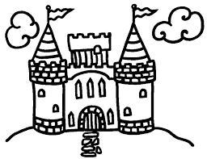
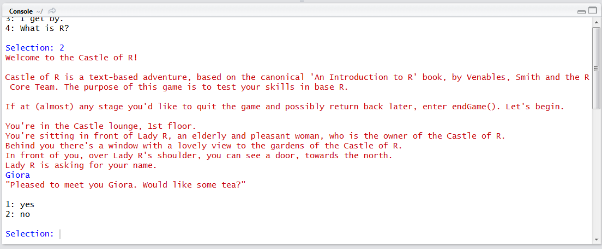

<!-- README.md is generated from README.Rmd. Please edit that file -->



Welcome to the Castle of R!

Castle of R is a text-based adventure, based on the canonical 'An Introduction to R' book, by Venables, Smith and the R Core Team. The purpose of this game is to test your skills in base R.

```{r, echo = FALSE}
knitr::opts_chunk$set(
  collapse = TRUE,
  comment = "#>",
  fig.path = "README-"
)
```

Install:
```{r, eval = FALSE}
devtools::install_github("gsimchoni/CastleOfR")
```

Load:
```{r, eval = FALSE}
library(CastleOfR)
```

Start game:
```{r, eval = FALSE}
startGame()
```



More information [here](http://giorasimchoni.com/2017/09/10/2017-09-10-you-re-in-a-room-the-castleofr-package/).